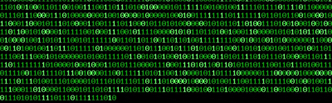

# Selim Taşdemir 👨‍💻

**Mekatronik Mühendisi | Yapay Zeka & Görüntü İşleme | Gömülü Sistemler | .NET & Python Geliştirici**

Merhaba! Ben **Selim Taşdemir**, Mekatronik Mühendisiyim. Python ve Lua ile görüntü işleme, yapay zeka ve insansız sistemler üzerine projeler geliştiriyorum. ASP.NET ile web/masaüstü uygulamaları geliştiriyor; C/C++ ile gömülü sistem projelerinde çalışıyorum. Teknolojiye olan tutkumla, yenilikçi çözümler üretmeye odaklanıyorum.

---

## 🚀 Öne Çıkan Projeler

- **[Ağır Yük Bırakan Drone ve Kaşif Drone Projesi (Profesyonel Deneyim)](#)**  
  2023 Mayıs – 2024 Aralık tarihleri arasında özel bir teknoloji firmasında yük taşıyabilen ve belirli noktalarda yük bırakabilen drone geliştirildi.Ayrıca termal kamera ile nesne canlı nesnelerin tespiti de gerçekleştirildi. Drone tasarım, yazılım ve elektronik entegrasyon alanında çalışmalar yapıldı ve bu süreçte proje yönetimi görevide üstlenildi.

- **[İnsansız Hava Aracı Geliştirme (Teknofest)](#)**  
  2019-2022 yılları arasında sabit kanat İHA geliştirildi. 2021 yılında takım kaptanı olarak proje yönetimi, elektronik ve yazılım geliştirme sorumlulukları üstlenildi.

- **[Hava Savunma Sistemi (YOLO V8 Nesne Tespiti Takibi + C# Arayüz)](/img/havaSavunma.gif)**  
  YOLO v8 ile nesne tanıma, C# arayüzü ile Arduino üzerinden motor kontrolü ve gerçek zamanlı görüntü takibi.

- **[CNN Tabanlı Konuşmacı Tanıma Uygulaması](/img/CNN_Tez.pdf)**  
  Lisans tezi olarak geliştirilen bu proje, ses verilerinden konuşmacı tanıma görevini başarıyla gerçekleştirdi.  
  Ortak çalışma: [Emrecan Güldoğan](https://github.com/emrecanguldogan)

- **[Model Uydu Yarışması – Arayüz & Uçuş Yazılımı](/img/uydu.jpg)**  
  Model uydu haberleşme ve kontrol arayüzü geliştirildi, uçuş yazılımı başarıyla tamamlandı.

---

## 🧠 Uzmanlık Alanları

- **Programlama:** Python, C#, JavaScript, C/C++  
- **Web Geliştirme:** ASP.NET, HTML, CSS  
- **Yapay Zeka:** CNN, RNN, LSTM | Kütüphaneler: TensorFlow, Keras, NumPy, Pandas  
- **Görüntü İşleme:** OpenCV, YOLO  
- **Gömülü Sistemler:** Arduino, Raspberry Pi, Teensy, ESP32  
- **Simülasyon & Tasarım:** MATLAB, SolidWorks, Fusion360, Proteus
- **Diğer:** Selenium, Jupyter Notebook, Git/GitHub, 3D Printer(fdm/sla)

---

## 💬 Sosyal Beceriler

**Takım çalışması**, **liderlik**, **etkili iletişim**, **analitik düşünme**, **problem çözme**, **araştırma ve geliştirme**

---

## 🏆 Başarılar

- 🥇 Teknofest İHA Yarışmaları – Takım kaptanlığı ve uçak / drone geliştirme  
- 🚀 Model Uydu Yarışması – Arayüz & uçuş yazılımı  
- 🎯 Hava Savunma Sistemi – Görüntü işleme ve kontrol sistemleri  
- 🗣️ Konuşmacı Tanıma Uygulaması – Yapay zeka destekli ses analizi  
- 🧪 Roket Yarışması – Yazılım ve teknik destek

---

## 📫 İletişim

- **📧 Mail:** selimtasdemirr@outlook.com  
- **🔗 LinkedIn:** [linkedin.com/in/selimtasdemir](https://www.linkedin.com/in/selimtasdemir)  
- **💻 GitHub:** [github.com/selimttasdemir](https://github.com/selimttasdemir?tab=repositories)

_Projelerim hakkında daha fazla bilgi almak veya iş birliği yapmak için bana ulaşabilirsiniz._

---

## 🧰 Kullandığım Araçlar ve Teknolojiler

  
  
  
  
  
  
  
  
  
  
  
  
  
  
  
  
  
  
  

---

## 📊 GitHub İstatistikleri

